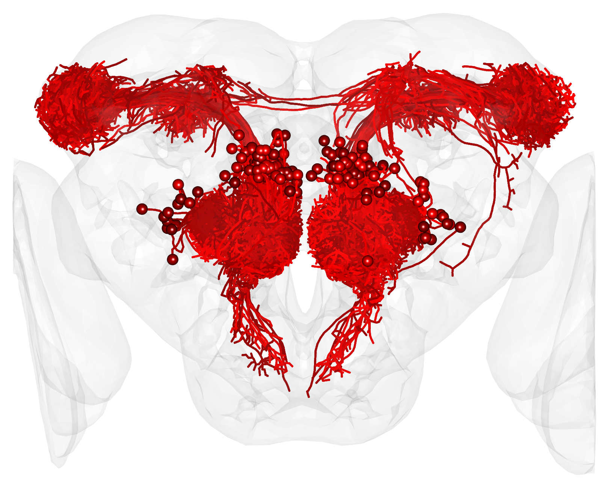

# Dürr et al. 2025

## Authors
Benedikt R. Dürr1,2, Enrico Bertolini1,3# , Suguru Takagi1#, Justine Pascual1,3#, Liliane Abuin1, Giovanna Lucarelli1, Richard Benton1, and Thomas O. Auer1,3*

1. Center for Integrative Genomics Faculty of Biology and Medicine, University of Lausanne CH-1015 Lausanne Switzerland
2. Current address: Centre for Organismal Studies, Heidelberg University, DE-69120 Heidelberg Germany
3. Department of Biology, University of Fribourg, CH-1700 Fribourg Switzerland

    \# equal contribution 
    \* Corresponding author: Thomas O. Auer E-mail: thomas.auer@unifr.ch

 

## Data
- Here we store the neuron datasets and files important for the analysis (see below).
- The folder 1_Duerr2025_Dataset_Dsec_ALPN_DsecI_SWCs contains 133 Drosophila sechellia (Dsec) antennal lobe projection neurons (ALPNs) in .swc format registered to the DsecI reference brain space
- Raw microscopy images and other big files are stored on Zenodo.

## Code

In this project we used R for the analysis.
To reproduce the figures presented in Dürr et al. 2025 we will explain below how the code is structured.
Contact us any time if you need help or want to give feedback on improving the code:
- write an email to thomas.auer@unifr.ch and CC benedikt.duerr@cos.uni-heidelberg.de

### 0 - Project Initialization
- This file contains all necessary packages and resources required for creating the figures.
- If you run the code for the first time, please install all necessary packages (see 1_Library_Installation).

### 1 - Library Installation
- This project uses the package [renv](https://rstudio.github.io/renv/articles/renv.html) to store the r environment, including all used packages. You can follow the link to get an idea how to use it to restore the r environment of this project. 
- Additional documentation on installation.

### 1 - Library Packages
- This file contains all packages

### 1 - Library Datasets
- Loads datasets and locations into the working environment.

### 1 - Library Visualisation
- Loads visualisation parameters used for the figures.
### 2 - Datasets - Our
- Here we query, sort and prepare datasets relevant for our analysis.

### 2 - Datasets - VFB
- Here we query, sort and prepare datasets relevant for our analysis.

### 3 - Glomeruli
- Here we prepare glomeruli annotations from AMIRA and MIP.
- We also demonstrated an open-source workflow to use Glomeruli Annotations created with the [Microscopy Image Browser](http://mib.helsinki.fi) instead of AMIRA.

### 4 - ALPN Annotation
- Here we manually annotated neurons after using NBLAST.

### 5 - ALPN dendrite quantification

### Figures
- Here we combined all necessary code to reproduce R-based figure panels shown in the manuscript of Dürr et al. 2025
- When reproducing a figure first source 0_Project_Initialization file as it loads necessary libraries and files
- All figures were successfully tested before the release using a full reinstallation of the software on MacOS. Still, there can be unforeseen problems when restarting the project. If this happens we are happy to help you when you encounter problem. We noticed that the rgl package sometimes generates problems with exporting 3D scenes. This can sometimes be resolved by updating or reinstalling the package. Otherwise feel free to contact us directly.

## Figures
- Folders used by the figure code to export the final figures.

## Tables
- Supplementary Table 3 & 4.

## Videos
- Jacobian map video; stored on Zenodo.
